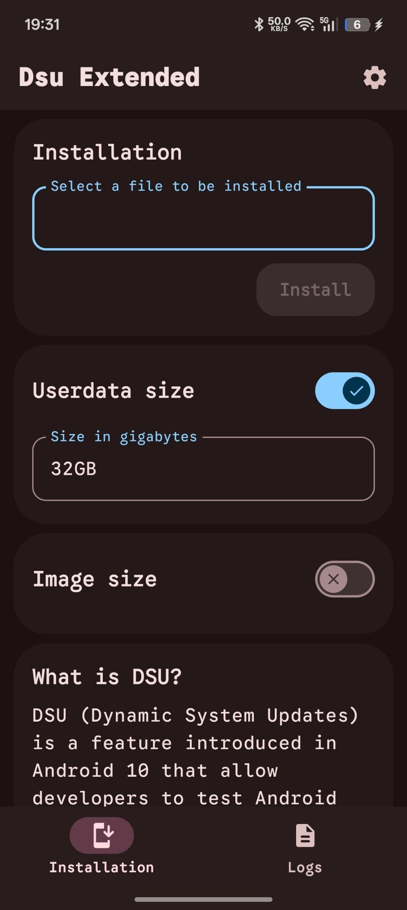
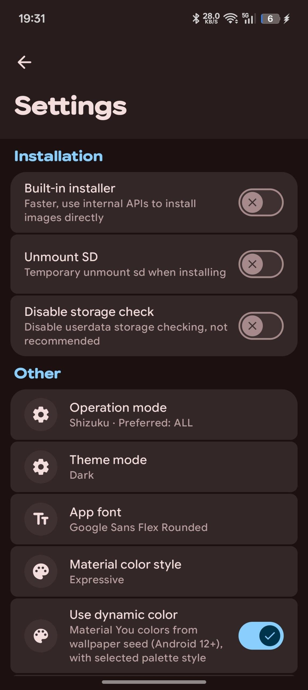

# Dsu Extended

Modern, feature-rich DSU (Dynamic System Update) installer for Android. Designed for ease of use and maximum compatibility.

| Preview 1 | Preview 2 |
| :---: | :---: |
|  |  |

## Features
- **Root/Shizuku/Dhizuku Support:** Works across various privilege levels.
- **Expressive UI:** Modern Material 3 Design with fluid animations.
- **Custom Font Support:** Includes Google Sans Code and Flex integration.
- **Built-in Diagnostics:** Advanced logcat and system status reporting.
- **SDK 37 Ready:** Built with the latest Android 17 toolchain.

## Build Requirements
- **JDK 26**
- **Gradle 9.7**
- **Android SDK 37 (Cinnamon Bun)**

## Credits
- **Main Developer:** [@kerneldroid](https://github.com/kerneldroid)
- **Original Fork Author:** [@senodroid](https://github.com/senodroid)
- **Partition Manager inspiration:** [DSU-Sideloader-Plus](https://github.com/yangFenTuoZi/DSU-Sideloader-Plus) by [@yangFenTuoZi](https://github.com/yangFenTuoZi)
